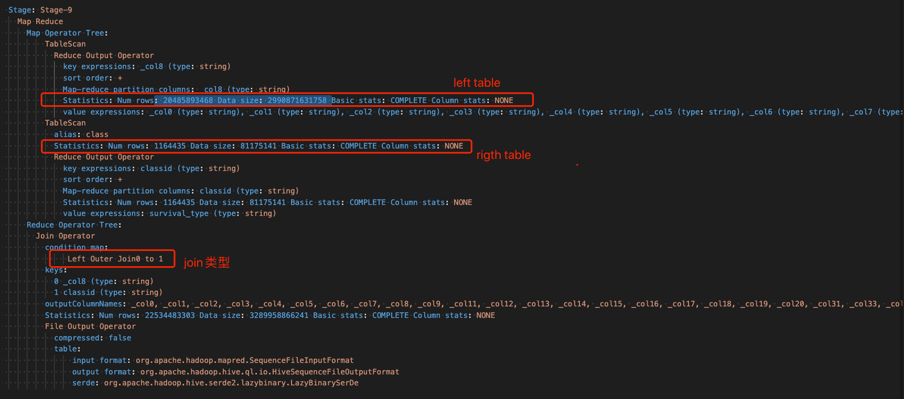
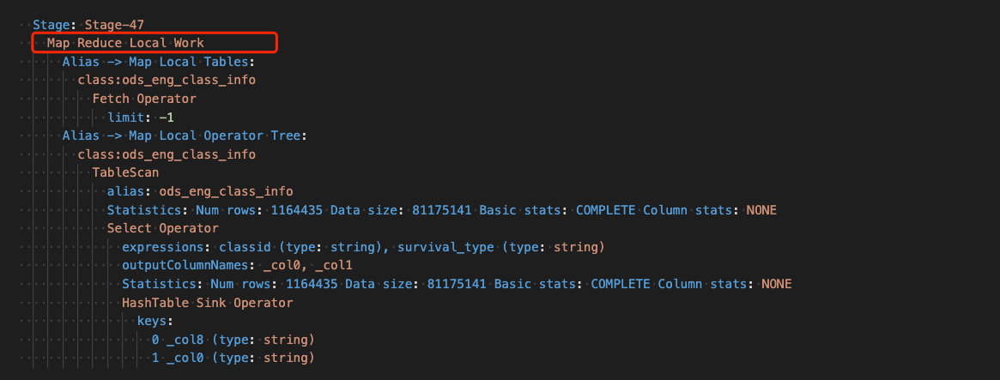

历史遗留sql，最近执行特别的慢，在逻辑不是很清楚的前提下尝试了进行优化，发现执行日志中有个stage输出日志显示耗时9个多小时
```
2022-02-08 11:53:26,166 Stage-9 map = 100%,  reduce = 99%, Cumulative CPU 395086.23 sec
2022-02-08 11:54:26,978 Stage-9 map = 100%,  reduce = 99%, Cumulative CPU 402858.84 sec
2022-02-08 11:55:27,892 Stage-9 map = 100%,  reduce = 99%, Cumulative CPU 403868.97 sec
2022-02-08 11:56:28,275 Stage-9 map = 100%,  reduce = 99%, Cumulative CPU 404110.16 sec
2022-02-08 11:57:28,786 Stage-9 map = 100%,  reduce = 99%, Cumulative CPU 404330.2 sec
2022-02-08 11:58:29,163 Stage-9 map = 100%,  reduce = 99%, Cumulative CPU 404549.96 sec
2022-02-08 11:59:29,336 Stage-9 map = 100%,  reduce = 99%, Cumulative CPU 404748.24 sec
2022-02-08 12:00:30,348 Stage-9 map = 100%,  reduce = 99%, Cumulative CPU 404962.65 sec
2022-02-08 12:01:31,360 Stage-9 map = 100%,  reduce = 99%, Cumulative CPU 405180.23 sec
2022-02-08 12:02:31,541 Stage-9 map = 100%,  reduce = 99%, Cumulative CPU 405393.39 sec
2022-02-08 12:03:31,979 Stage-9 map = 100%,  reduce = 99%, Cumulative CPU 405634.97 sec
2022-02-08 12:04:32,176 Stage-9 map = 100%,  reduce = 99%, Cumulative CPU 405924.91 sec
2022-02-08 12:05:32,587 Stage-9 map = 100%,  reduce = 99%, Cumulative CPU 406059.75 sec
2022-02-08 12:06:33,067 Stage-9 map = 100%,  reduce = 99%, Cumulative CPU 406121.06 sec
2022-02-08 12:07:34,119 Stage-9 map = 100%,  reduce = 99%, Cumulative CPU 406184.44 sec
2022-02-08 12:08:35,196 Stage-9 map = 100%,  reduce = 99%, Cumulative CPU 406245.84 sec
2022-02-08 12:09:35,984 Stage-9 map = 100%,  reduce = 99%, Cumulative CPU 406306.87 sec
2022-02-08 12:10:36,989 Stage-9 map = 100%,  reduce = 99%, Cumulative CPU 406369.45 sec
2022-02-08 12:11:36,994 Stage-9 map = 100%,  reduce = 99%, Cumulative CPU 406427.31 sec
2022-02-08 12:12:37,650 Stage-9 map = 100%,  reduce = 99%, Cumulative CPU 406488.56 sec
2022-02-08 12:13:37,672 Stage-9 map = 100%,  reduce = 99%, Cumulative CPU 406550.34 sec
2022-02-08 12:14:38,384 Stage-9 map = 100%,  reduce = 99%, Cumulative CPU 406612.07 sec
2022-02-08 12:15:39,435 Stage-9 map = 100%,  reduce = 99%, Cumulative CPU 406692.02 sec
2022-02-08 12:16:40,312 Stage-9 map = 100%,  reduce = 99%, Cumulative CPU 406772.47 sec
2022-02-08 12:17:40,774 Stage-9 map = 100%,  reduce = 99%, Cumulative CPU 406850.3 sec
2022-02-08 12:18:41,491 Stage-9 map = 100%,  reduce = 99%, Cumulative CPU 406925.54 sec
2022-02-08 12:19:41,516 Stage-9 map = 100%,  reduce = 99%, Cumulative CPU 407000.82 sec
2022-02-08 12:20:42,035 Stage-9 map = 100%,  reduce = 99%, Cumulative CPU 407073.36 sec
2022-02-08 12:21:42,189 Stage-9 map = 100%,  reduce = 99%, Cumulative CPU 407142.1 sec
2022-02-08 12:22:43,129 Stage-9 map = 100%,  reduce = 99%, Cumulative CPU 407215.42 sec
2022-02-08 12:23:43,998 Stage-9 map = 100%,  reduce = 99%, Cumulative CPU 407291.02 sec
2022-02-08 12:24:44,880 Stage-9 map = 100%,  reduce = 99%, Cumulative CPU 407364.05 sec
2022-02-08 12:25:45,547 Stage-9 map = 100%,  reduce = 99%, Cumulative CPU 407438.78 sec
2022-02-08 12:26:46,418 Stage-9 map = 100%,  reduce = 99%, Cumulative CPU 407517.19 sec
2022-02-08 12:27:46,484 Stage-9 map = 100%,  reduce = 99%, Cumulative CPU 407588.81 sec
2022-02-08 12:28:47,354 Stage-9 map = 100%,  reduce = 99%, Cumulative CPU 407662.63 sec
2022-02-08 12:29:47,852 Stage-9 map = 100%,  reduce = 99%, Cumulative CPU 407737.86 sec
2022-02-08 12:30:48,405 Stage-9 map = 100%,  reduce = 99%, Cumulative CPU 407815.37 sec
2022-02-08 12:31:49,011 Stage-9 map = 100%,  reduce = 99%, Cumulative CPU 407891.57 sec
2022-02-08 12:32:49,199 Stage-9 map = 100%,  reduce = 99%, Cumulative CPU 407966.01 sec
2022-02-08 12:33:49,983 Stage-9 map = 100%,  reduce = 99%, Cumulative CPU 408042.97 sec
2022-02-08 12:34:50,264 Stage-9 map = 100%,  reduce = 99%, Cumulative CPU 408118.12 sec
2022-02-08 12:35:50,982 Stage-9 map = 100%,  reduce = 99%, Cumulative CPU 408194.65 sec
2022-02-08 12:36:51,521 Stage-9 map = 100%,  reduce = 99%, Cumulative CPU 408271.31 sec
2022-02-08 12:37:52,266 Stage-9 map = 100%,  reduce = 99%, Cumulative CPU 408348.37 sec
2022-02-08 12:38:53,079 Stage-9 map = 100%,  reduce = 99%, Cumulative CPU 408423.68 sec
2022-02-08 12:39:53,928 Stage-9 map = 100%,  reduce = 99%, Cumulative CPU 408502.68 sec
2022-02-08 12:40:54,804 Stage-9 map = 100%,  reduce = 99%, Cumulative CPU 408582.05 sec
2022-02-08 12:41:55,617 Stage-9 map = 100%,  reduce = 99%, Cumulative CPU 408658.52 sec
2022-02-08 12:42:55,991 Stage-9 map = 100%,  reduce = 99%, Cumulative CPU 408734.83 sec
2022-02-08 12:43:56,978 Stage-9 map = 100%,  reduce = 99%, Cumulative CPU 408810.61 sec
2022-02-08 12:44:57,936 Stage-9 map = 100%,  reduce = 99%, Cumulative CPU 408890.22 sec
2022-02-08 12:45:58,624 Stage-9 map = 100%,  reduce = 99%, Cumulative CPU 408967.84 sec
2022-02-08 12:46:59,458 Stage-9 map = 100%,  reduce = 99%, Cumulative CPU 409045.15 sec
2022-02-08 12:48:00,286 Stage-9 map = 100%,  reduce = 99%, Cumulative CPU 409121.55 sec
2022-02-08 12:49:01,318 Stage-9 map = 100%,  reduce = 99%, Cumulative CPU 409199.74 sec
2022-02-08 12:50:02,060 Stage-9 map = 100%,  reduce = 99%, Cumulative CPU 409279.39 sec
2022-02-08 12:51:03,022 Stage-9 map = 100%,  reduce = 99%, Cumulative CPU 409360.55 sec
2022-02-08 12:52:03,718 Stage-9 map = 100%,  reduce = 99%, Cumulative CPU 409437.65 sec
2022-02-08 12:53:04,461 Stage-9 map = 100%,  reduce = 99%, Cumulative CPU 409515.49 sec
2022-02-08 12:54:05,427 Stage-9 map = 100%,  reduce = 99%, Cumulative CPU 409592.17 sec
2022-02-08 12:55:06,180 Stage-9 map = 100%,  reduce = 99%, Cumulative CPU 409670.9 sec
2022-02-08 12:56:06,812 Stage-9 map = 100%,  reduce = 99%, Cumulative CPU 409746.99 sec
2022-02-08 12:57:07,053 Stage-9 map = 100%,  reduce = 99%, Cumulative CPU 409825.12 sec
2022-02-08 12:58:07,518 Stage-9 map = 100%,  reduce = 99%, Cumulative CPU 409901.98 sec
2022-02-08 12:59:08,226 Stage-9 map = 100%,  reduce = 99%, Cumulative CPU 409978.96 sec
2022-02-08 13:00:08,724 Stage-9 map = 100%,  reduce = 99%, Cumulative CPU 410058.26 sec
2022-02-08 13:01:09,156 Stage-9 map = 100%,  reduce = 99%, Cumulative CPU 410136.16 sec
2022-02-08 13:02:09,670 Stage-9 map = 100%,  reduce = 99%, Cumulative CPU 410214.65 sec
2022-02-08 13:03:10,345 Stage-9 map = 100%,  reduce = 99%, Cumulative CPU 410290.53 sec
2022-02-08 13:04:10,959 Stage-9 map = 100%,  reduce = 99%, Cumulative CPU 410369.25 sec
2022-02-08 13:05:11,572 Stage-9 map = 100%,  reduce = 99%, Cumulative CPU 410448.42 sec
2022-02-08 13:06:12,151 Stage-9 map = 100%,  reduce = 99%, Cumulative CPU 410525.32 sec
2022-02-08 13:07:12,833 Stage-9 map = 100%,  reduce = 99%, Cumulative CPU 410603.2 sec
2022-02-08 13:08:13,352 Stage-9 map = 100%,  reduce = 99%, Cumulative CPU 410683.62 sec
2022-02-08 13:09:13,958 Stage-9 map = 100%,  reduce = 99%, Cumulative CPU 410761.09 sec
2022-02-08 13:10:14,935 Stage-9 map = 100%,  reduce = 99%, Cumulative CPU 410838.19 sec
2022-02-08 13:11:15,491 Stage-9 map = 100%,  reduce = 99%, Cumulative CPU 410918.04 sec
2022-02-08 13:12:15,748 Stage-9 map = 100%,  reduce = 99%, Cumulative CPU 410996.31 sec
2022-02-08 13:13:16,309 Stage-9 map = 100%,  reduce = 99%, Cumulative CPU 411074.79 sec
2022-02-08 13:14:16,969 Stage-9 map = 100%,  reduce = 99%, Cumulative CPU 411152.01 sec
2022-02-08 13:15:17,234 Stage-9 map = 100%,  reduce = 99%, Cumulative CPU 411231.65 sec
2022-02-08 13:16:17,264 Stage-9 map = 100%,  reduce = 99%, Cumulative CPU 411308.09 sec
2022-02-08 13:17:18,238 Stage-9 map = 100%,  reduce = 99%, Cumulative CPU 411386.7 sec
2022-02-08 13:18:19,073 Stage-9 map = 100%,  reduce = 99%, Cumulative CPU 411469.48 sec
2022-02-08 13:19:19,639 Stage-9 map = 100%,  reduce = 99%, Cumulative CPU 411547.14 sec
2022-02-08 13:20:20,261 Stage-9 map = 100%,  reduce = 99%, Cumulative CPU 411625.89 sec
2022-02-08 13:21:20,575 Stage-9 map = 100%,  reduce = 99%, Cumulative CPU 411697.92 sec
2022-02-08 13:22:20,726 Stage-9 map = 100%,  reduce = 99%, Cumulative CPU 411768.45 sec
2022-02-08 13:23:21,335 Stage-9 map = 100%,  reduce = 99%, Cumulative CPU 411848.7 sec
2022-02-08 13:24:21,985 Stage-9 map = 100%,  reduce = 99%, Cumulative CPU 411929.5 sec
2022-02-08 13:25:22,649 Stage-9 map = 100%,  reduce = 99%, Cumulative CPU 412007.65 sec
2022-02-08 13:26:23,281 Stage-9 map = 100%,  reduce = 99%, Cumulative CPU 412085.44 sec
2022-02-08 13:27:23,419 Stage-9 map = 100%,  reduce = 99%, Cumulative CPU 412159.55 sec
2022-02-08 13:28:23,462 Stage-9 map = 100%,  reduce = 99%, Cumulative CPU 412244.01 sec
2022-02-08 13:29:23,464 Stage-9 map = 100%,  reduce = 99%, Cumulative CPU 412321.82 sec
2022-02-08 13:30:23,625 Stage-9 map = 100%,  reduce = 99%, Cumulative CPU 412400.52 sec
2022-02-08 13:31:24,596 Stage-9 map = 100%,  reduce = 99%, Cumulative CPU 412479.77 sec
2022-02-08 13:32:25,436 Stage-9 map = 100%,  reduce = 99%, Cumulative CPU 412559.72 sec
2022-02-08 13:33:26,049 Stage-9 map = 100%,  reduce = 99%, Cumulative CPU 412637.17 sec
2022-02-08 13:34:26,834 Stage-9 map = 100%,  reduce = 99%, Cumulative CPU 412713.66 sec
2022-02-08 13:35:27,022 Stage-9 map = 100%,  reduce = 99%, Cumulative CPU 412797.48 sec
2022-02-08 13:36:27,869 Stage-9 map = 100%,  reduce = 99%, Cumulative CPU 412874.32 sec
2022-02-08 13:37:28,429 Stage-9 map = 100%,  reduce = 99%, Cumulative CPU 412953.1 sec
2022-02-08 13:38:29,383 Stage-9 map = 100%,  reduce = 99%, Cumulative CPU 413032.06 sec
2022-02-08 13:39:30,001 Stage-9 map = 100%,  reduce = 99%, Cumulative CPU 413110.5 sec
2022-02-08 13:40:30,698 Stage-9 map = 100%,  reduce = 99%, Cumulative CPU 413190.09 sec
2022-02-08 13:41:31,718 Stage-9 map = 100%,  reduce = 99%, Cumulative CPU 413272.2 sec
2022-02-08 13:42:32,366 Stage-9 map = 100%,  reduce = 99%, Cumulative CPU 413352.06 sec
2022-02-08 13:43:33,081 Stage-9 map = 100%,  reduce = 99%, Cumulative CPU 413428.77 sec
2022-02-08 13:44:33,663 Stage-9 map = 100%,  reduce = 99%, Cumulative CPU 413510.08 sec
2022-02-08 13:45:34,286 Stage-9 map = 100%,  reduce = 99%, Cumulative CPU 413589.14 sec
2022-02-08 13:46:35,071 Stage-9 map = 100%,  reduce = 99%, Cumulative CPU 413667.93 sec
2022-02-08 13:47:35,984 Stage-9 map = 100%,  reduce = 99%, Cumulative CPU 413746.11 sec
2022-02-08 13:48:36,513 Stage-9 map = 100%,  reduce = 99%, Cumulative CPU 413824.0 sec
2022-02-08 13:49:37,193 Stage-9 map = 100%,  reduce = 99%, Cumulative CPU 413904.01 sec
2022-02-08 13:50:37,766 Stage-9 map = 100%,  reduce = 99%, Cumulative CPU 413982.95 sec
2022-02-08 13:51:38,567 Stage-9 map = 100%,  reduce = 99%, Cumulative CPU 414059.73 sec
2022-02-08 13:52:39,332 Stage-9 map = 100%,  reduce = 99%, Cumulative CPU 414139.41 sec
2022-02-08 13:53:40,043 Stage-9 map = 100%,  reduce = 99%, Cumulative CPU 414221.09 sec
2022-02-08 13:54:40,655 Stage-9 map = 100%,  reduce = 99%, Cumulative CPU 414298.86 sec
2022-02-08 13:55:41,430 Stage-9 map = 100%,  reduce = 99%, Cumulative CPU 414379.2 sec
2022-02-08 13:56:42,231 Stage-9 map = 100%,  reduce = 99%, Cumulative CPU 414449.2 sec
2022-02-08 13:57:43,056 Stage-9 map = 100%,  reduce = 99%, Cumulative CPU 414521.35 sec
2022-02-08 13:58:43,846 Stage-9 map = 100%,  reduce = 99%, Cumulative CPU 414596.85 sec
2022-02-08 13:59:44,444 Stage-9 map = 100%,  reduce = 99%, Cumulative CPU 414674.36 sec
2022-02-08 14:00:45,250 Stage-9 map = 100%,  reduce = 99%, Cumulative CPU 414755.45 sec
2022-02-08 14:01:46,065 Stage-9 map = 100%,  reduce = 99%, Cumulative CPU 414834.14 sec
2022-02-08 14:02:46,844 Stage-9 map = 100%,  reduce = 99%, Cumulative CPU 414912.05 sec
2022-02-08 14:03:47,558 Stage-9 map = 100%,  reduce = 99%, Cumulative CPU 414992.82 sec
2022-02-08 14:04:48,435 Stage-9 map = 100%,  reduce = 99%, Cumulative CPU 415070.4 sec
2022-02-08 14:05:48,755 Stage-9 map = 100%,  reduce = 99%, Cumulative CPU 415149.56 sec
2022-02-08 14:06:49,371 Stage-9 map = 100%,  reduce = 99%, Cumulative CPU 415228.2 sec
2022-02-08 14:07:50,084 Stage-9 map = 100%,  reduce = 99%, Cumulative CPU 415308.66 sec
2022-02-08 14:08:50,836 Stage-9 map = 100%,  reduce = 99%, Cumulative CPU 415391.76 sec
2022-02-08 14:09:51,631 Stage-9 map = 100%,  reduce = 99%, Cumulative CPU 415465.62 sec
2022-02-08 14:10:52,309 Stage-9 map = 100%,  reduce = 99%, Cumulative CPU 415542.72 sec
2022-02-08 14:11:52,955 Stage-9 map = 100%,  reduce = 99%, Cumulative CPU 415620.76 sec
2022-02-08 14:12:53,595 Stage-9 map = 100%,  reduce = 99%, Cumulative CPU 415698.82 sec
2022-02-08 14:13:54,316 Stage-9 map = 100%,  reduce = 99%, Cumulative CPU 415778.49 sec
2022-02-08 14:14:54,990 Stage-9 map = 100%,  reduce = 99%, Cumulative CPU 415856.7 sec
2022-02-08 14:15:55,646 Stage-9 map = 100%,  reduce = 99%, Cumulative CPU 415935.08 sec
2022-02-08 14:16:56,564 Stage-9 map = 100%,  reduce = 99%, Cumulative CPU 416013.96 sec
2022-02-08 14:17:57,569 Stage-9 map = 100%,  reduce = 99%, Cumulative CPU 416092.51 sec
2022-02-08 14:18:58,138 Stage-9 map = 100%,  reduce = 99%, Cumulative CPU 416171.38 sec
2022-02-08 14:19:58,961 Stage-9 map = 100%,  reduce = 99%, Cumulative CPU 416249.9 sec
2022-02-08 14:20:59,604 Stage-9 map = 100%,  reduce = 99%, Cumulative CPU 416328.27 sec
2022-02-08 14:22:00,055 Stage-9 map = 100%,  reduce = 99%, Cumulative CPU 416403.52 sec
2022-02-08 14:23:00,756 Stage-9 map = 100%,  reduce = 99%, Cumulative CPU 416479.24 sec
2022-02-08 14:24:01,597 Stage-9 map = 100%,  reduce = 99%, Cumulative CPU 416557.03 sec
2022-02-08 14:25:02,395 Stage-9 map = 100%,  reduce = 99%, Cumulative CPU 416635.59 sec
2022-02-08 14:26:02,957 Stage-9 map = 100%,  reduce = 99%, Cumulative CPU 416718.03 sec
2022-02-08 14:27:03,611 Stage-9 map = 100%,  reduce = 99%, Cumulative CPU 416796.63 sec
2022-02-08 14:28:04,394 Stage-9 map = 100%,  reduce = 99%, Cumulative CPU 416873.71 sec
2022-02-08 14:29:05,254 Stage-9 map = 100%,  reduce = 99%, Cumulative CPU 416951.2 sec
2022-02-08 14:30:06,091 Stage-9 map = 100%,  reduce = 99%, Cumulative CPU 417029.27 sec
2022-02-08 14:31:06,791 Stage-9 map = 100%,  reduce = 99%, Cumulative CPU 417107.09 sec
2022-02-08 14:32:07,569 Stage-9 map = 100%,  reduce = 99%, Cumulative CPU 417185.46 sec
2022-02-08 14:33:08,267 Stage-9 map = 100%,  reduce = 99%, Cumulative CPU 417264.19 sec
2022-02-08 14:34:08,900 Stage-9 map = 100%,  reduce = 99%, Cumulative CPU 417342.12 sec
2022-02-08 14:35:09,446 Stage-9 map = 100%,  reduce = 99%, Cumulative CPU 417422.43 sec
2022-02-08 14:36:10,354 Stage-9 map = 100%,  reduce = 99%, Cumulative CPU 417501.42 sec
2022-02-08 14:37:11,016 Stage-9 map = 100%,  reduce = 99%, Cumulative CPU 417579.92 sec
2022-02-08 14:38:11,628 Stage-9 map = 100%,  reduce = 99%, Cumulative CPU 417658.73 sec
2022-02-08 14:39:11,635 Stage-9 map = 100%,  reduce = 99%, Cumulative CPU 417737.42 sec
2022-02-08 14:40:12,495 Stage-9 map = 100%,  reduce = 99%, Cumulative CPU 417817.33 sec
2022-02-08 14:41:13,462 Stage-9 map = 100%,  reduce = 99%, Cumulative CPU 417894.87 sec
2022-02-08 14:42:14,073 Stage-9 map = 100%,  reduce = 99%, Cumulative CPU 417973.09 sec
2022-02-08 14:43:14,819 Stage-9 map = 100%,  reduce = 99%, Cumulative CPU 418050.72 sec
2022-02-08 14:44:15,463 Stage-9 map = 100%,  reduce = 99%, Cumulative CPU 418129.27 sec
2022-02-08 14:45:16,239 Stage-9 map = 100%,  reduce = 99%, Cumulative CPU 418206.48 sec
2022-02-08 14:46:16,961 Stage-9 map = 100%,  reduce = 99%, Cumulative CPU 418286.14 sec
2022-02-08 14:47:17,810 Stage-9 map = 100%,  reduce = 99%, Cumulative CPU 418369.13 sec
2022-02-08 14:48:18,499 Stage-9 map = 100%,  reduce = 99%, Cumulative CPU 418447.2 sec
2022-02-08 14:49:19,280 Stage-9 map = 100%,  reduce = 99%, Cumulative CPU 418526.05 sec
2022-02-08 14:50:19,949 Stage-9 map = 100%,  reduce = 99%, Cumulative CPU 418603.36 sec
2022-02-08 14:51:20,135 Stage-9 map = 100%,  reduce = 99%, Cumulative CPU 418678.53 sec
2022-02-08 14:52:21,305 Stage-9 map = 100%,  reduce = 99%, Cumulative CPU 418754.98 sec
2022-02-08 14:53:22,001 Stage-9 map = 100%,  reduce = 99%, Cumulative CPU 418833.1 sec
2022-02-08 14:54:22,808 Stage-9 map = 100%,  reduce = 99%, Cumulative CPU 418910.89 sec
2022-02-08 14:55:23,589 Stage-9 map = 100%,  reduce = 99%, Cumulative CPU 418988.64 sec
2022-02-08 14:56:24,261 Stage-9 map = 100%,  reduce = 99%, Cumulative CPU 419067.19 sec
2022-02-08 14:57:24,899 Stage-9 map = 100%,  reduce = 99%, Cumulative CPU 419144.9 sec
2022-02-08 14:58:25,511 Stage-9 map = 100%,  reduce = 99%, Cumulative CPU 419223.49 sec
2022-02-08 14:59:26,187 Stage-9 map = 100%,  reduce = 99%, Cumulative CPU 419302.29 sec
2022-02-08 15:00:26,854 Stage-9 map = 100%,  reduce = 99%, Cumulative CPU 419380.5 sec
2022-02-08 15:01:27,483 Stage-9 map = 100%,  reduce = 99%, Cumulative CPU 419458.73 sec
2022-02-08 15:02:28,276 Stage-9 map = 100%,  reduce = 99%, Cumulative CPU 419537.3 sec
2022-02-08 15:03:28,948 Stage-9 map = 100%,  reduce = 99%, Cumulative CPU 419616.12 sec
2022-02-08 15:04:29,952 Stage-9 map = 100%,  reduce = 99%, Cumulative CPU 419694.46 sec
2022-02-08 15:05:30,382 Stage-9 map = 100%,  reduce = 99%, Cumulative CPU 419773.17 sec
2022-02-08 15:06:31,171 Stage-9 map = 100%,  reduce = 99%, Cumulative CPU 419852.15 sec
2022-02-08 15:07:32,199 Stage-9 map = 100%,  reduce = 99%, Cumulative CPU 419931.64 sec
2022-02-08 15:08:32,978 Stage-9 map = 100%,  reduce = 99%, Cumulative CPU 420014.22 sec
2022-02-08 15:09:33,727 Stage-9 map = 100%,  reduce = 99%, Cumulative CPU 420092.48 sec
2022-02-08 15:10:34,428 Stage-9 map = 100%,  reduce = 99%, Cumulative CPU 420171.18 sec
2022-02-08 15:11:35,426 Stage-9 map = 100%,  reduce = 99%, Cumulative CPU 420248.89 sec
2022-02-08 15:12:36,245 Stage-9 map = 100%,  reduce = 99%, Cumulative CPU 420327.1 sec
2022-02-08 15:13:37,056 Stage-9 map = 100%,  reduce = 99%, Cumulative CPU 420404.18 sec
2022-02-08 15:14:37,673 Stage-9 map = 100%,  reduce = 99%, Cumulative CPU 420483.39 sec
2022-02-08 15:15:38,349 Stage-9 map = 100%,  reduce = 99%, Cumulative CPU 420561.1 sec
2022-02-08 15:16:39,244 Stage-9 map = 100%,  reduce = 99%, Cumulative CPU 420639.17 sec
2022-02-08 15:17:39,856 Stage-9 map = 100%,  reduce = 99%, Cumulative CPU 420717.58 sec
2022-02-08 15:18:40,583 Stage-9 map = 100%,  reduce = 99%, Cumulative CPU 420795.76 sec
2022-02-08 15:19:41,420 Stage-9 map = 100%,  reduce = 99%, Cumulative CPU 420873.11 sec
2022-02-08 15:20:28,599 Stage-9 map = 100%,  reduce = 100%, Cumulative CPU 420937.92 sec
2022-02-08 15:21:29,642 Stage-9 map = 100%,  reduce = 100%, Cumulative CPU 421005.73 sec
2022-02-08 15:22:29,851 Stage-9 map = 100%,  reduce = 100%, Cumulative CPU 421076.24 sec
2022-02-08 15:23:30,608 Stage-9 map = 100%,  reduce = 100%, Cumulative CPU 421146.76 sec
2022-02-08 15:24:31,415 Stage-9 map = 100%,  reduce = 100%, Cumulative CPU 421218.16 sec
2022-02-08 15:25:32,232 Stage-9 map = 100%,  reduce = 100%, Cumulative CPU 421288.08 sec
2022-02-08 15:26:32,917 Stage-9 map = 100%,  reduce = 100%, Cumulative CPU 421357.3 sec
2022-02-08 15:27:33,614 Stage-9 map = 100%,  reduce = 100%, Cumulative CPU 421425.91 sec
2022-02-08 15:28:34,343 Stage-9 map = 100%,  reduce = 100%, Cumulative CPU 421493.29 sec
2022-02-08 15:29:35,070 Stage-9 map = 100%,  reduce = 100%, Cumulative CPU 421561.67 sec
2022-02-08 15:30:35,803 Stage-9 map = 100%,  reduce = 100%, Cumulative CPU 421629.79 sec
2022-02-08 15:31:36,353 Stage-9 map = 100%,  reduce = 100%, Cumulative CPU 421697.55 sec
2022-02-08 15:32:36,965 Stage-9 map = 100%,  reduce = 100%, Cumulative CPU 421765.23 sec
2022-02-08 15:33:37,776 Stage-9 map = 100%,  reduce = 100%, Cumulative CPU 421832.84 sec
2022-02-08 15:34:38,568 Stage-9 map = 100%,  reduce = 100%, Cumulative CPU 421900.84 sec
2022-02-08 15:35:39,288 Stage-9 map = 100%,  reduce = 100%, Cumulative CPU 421967.45 sec
2022-02-08 15:36:40,311 Stage-9 map = 100%,  reduce = 100%, Cumulative CPU 422034.29 sec
2022-02-08 15:37:41,038 Stage-9 map = 100%,  reduce = 100%, Cumulative CPU 422101.65 sec
2022-02-08 15:38:41,709 Stage-9 map = 100%,  reduce = 100%, Cumulative CPU 422168.62 sec
2022-02-08 15:39:42,570 Stage-9 map = 100%,  reduce = 100%, Cumulative CPU 422236.81 sec
2022-02-08 15:40:43,476 Stage-9 map = 100%,  reduce = 100%, Cumulative CPU 422307.54 sec
2022-02-08 15:41:44,523 Stage-9 map = 100%,  reduce = 100%, Cumulative CPU 422374.56 sec
2022-02-08 15:42:45,250 Stage-9 map = 100%,  reduce = 100%, Cumulative CPU 422442.74 sec
2022-02-08 15:43:45,952 Stage-9 map = 100%,  reduce = 100%, Cumulative CPU 422509.35 sec
2022-02-08 15:44:46,640 Stage-9 map = 100%,  reduce = 100%, Cumulative CPU 422576.33 sec
2022-02-08 15:45:47,222 Stage-9 map = 100%,  reduce = 100%, Cumulative CPU 422643.75 sec
2022-02-08 15:46:47,914 Stage-9 map = 100%,  reduce = 100%, Cumulative CPU 422712.62 sec
2022-02-08 15:47:48,546 Stage-9 map = 100%,  reduce = 100%, Cumulative CPU 422779.77 sec
2022-02-08 15:48:49,511 Stage-9 map = 100%,  reduce = 100%, Cumulative CPU 422847.76 sec
2022-02-08 15:49:50,152 Stage-9 map = 100%,  reduce = 100%, Cumulative CPU 422915.22 sec
2022-02-08 15:50:50,937 Stage-9 map = 100%,  reduce = 100%, Cumulative CPU 422983.05 sec
2022-02-08 15:51:51,853 Stage-9 map = 100%,  reduce = 100%, Cumulative CPU 423050.16 sec
2022-02-08 15:52:52,721 Stage-9 map = 100%,  reduce = 100%, Cumulative CPU 423117.09 sec
2022-02-08 15:53:53,419 Stage-9 map = 100%,  reduce = 100%, Cumulative CPU 423184.66 sec
2022-02-08 15:54:54,229 Stage-9 map = 100%,  reduce = 100%, Cumulative CPU 423252.63 sec
2022-02-08 15:55:54,957 Stage-9 map = 100%,  reduce = 100%, Cumulative CPU 423319.93 sec
2022-02-08 15:56:55,911 Stage-9 map = 100%,  reduce = 100%, Cumulative CPU 423387.96 sec
2022-02-08 15:57:56,585 Stage-9 map = 100%,  reduce = 100%, Cumulative CPU 423454.6 sec
2022-02-08 15:58:57,294 Stage-9 map = 100%,  reduce = 100%, Cumulative CPU 423522.81 sec
2022-02-08 15:59:57,967 Stage-9 map = 100%,  reduce = 100%, Cumulative CPU 423591.28 sec
2022-02-08 16:00:58,648 Stage-9 map = 100%,  reduce = 100%, Cumulative CPU 423658.68 sec
2022-02-08 16:01:59,696 Stage-9 map = 100%,  reduce = 100%, Cumulative CPU 423729.65 sec
2022-02-08 16:03:00,356 Stage-9 map = 100%,  reduce = 100%, Cumulative CPU 423797.56 sec
2022-02-08 16:04:00,988 Stage-9 map = 100%,  reduce = 100%, Cumulative CPU 423865.08 sec
2022-02-08 16:05:01,634 Stage-9 map = 100%,  reduce = 100%, Cumulative CPU 423933.27 sec
2022-02-08 16:06:01,640 Stage-9 map = 100%,  reduce = 100%, Cumulative CPU 423997.88 sec
2022-02-08 16:07:02,375 Stage-9 map = 100%,  reduce = 100%, Cumulative CPU 424064.99 sec
2022-02-08 16:08:03,018 Stage-9 map = 100%,  reduce = 100%, Cumulative CPU 424136.06 sec
2022-02-08 16:09:03,702 Stage-9 map = 100%,  reduce = 100%, Cumulative CPU 424204.4 sec
2022-02-08 16:10:04,310 Stage-9 map = 100%,  reduce = 100%, Cumulative CPU 424272.75 sec
2022-02-08 16:11:04,881 Stage-9 map = 100%,  reduce = 100%, Cumulative CPU 424337.22 sec
2022-02-08 16:12:05,485 Stage-9 map = 100%,  reduce = 100%, Cumulative CPU 424404.72 sec
2022-02-08 16:13:06,186 Stage-9 map = 100%,  reduce = 100%, Cumulative CPU 424473.08 sec
2022-02-08 16:14:06,806 Stage-9 map = 100%,  reduce = 100%, Cumulative CPU 424541.16 sec
2022-02-08 16:15:07,601 Stage-9 map = 100%,  reduce = 100%, Cumulative CPU 424612.25 sec
2022-02-08 16:16:08,500 Stage-9 map = 100%,  reduce = 100%, Cumulative CPU 424679.66 sec
2022-02-08 16:17:09,182 Stage-9 map = 100%,  reduce = 100%, Cumulative CPU 424747.49 sec
2022-02-08 16:18:09,843 Stage-9 map = 100%,  reduce = 100%, Cumulative CPU 424814.45 sec
2022-02-08 16:19:10,514 Stage-9 map = 100%,  reduce = 100%, Cumulative CPU 424882.6 sec
2022-02-08 16:20:10,773 Stage-9 map = 100%,  reduce = 100%, Cumulative CPU 424951.28 sec
2022-02-08 16:21:11,574 Stage-9 map = 100%,  reduce = 100%, Cumulative CPU 425021.74 sec
2022-02-08 16:22:12,294 Stage-9 map = 100%,  reduce = 100%, Cumulative CPU 425089.69 sec
2022-02-08 16:23:13,056 Stage-9 map = 100%,  reduce = 100%, Cumulative CPU 425162.64 sec
2022-02-08 16:24:13,749 Stage-9 map = 100%,  reduce = 100%, Cumulative CPU 425230.16 sec
2022-02-08 16:25:14,360 Stage-9 map = 100%,  reduce = 100%, Cumulative CPU 425304.21 sec
2022-02-08 16:26:15,052 Stage-9 map = 100%,  reduce = 100%, Cumulative CPU 425364.6 sec
2022-02-08 16:27:15,600 Stage-9 map = 100%,  reduce = 100%, Cumulative CPU 425440.88 sec
2022-02-08 16:28:16,368 Stage-9 map = 100%,  reduce = 100%, Cumulative CPU 425514.99 sec
2022-02-08 16:29:17,137 Stage-9 map = 100%,  reduce = 100%, Cumulative CPU 425589.56 sec
2022-02-08 16:30:17,840 Stage-9 map = 100%,  reduce = 100%, Cumulative CPU 425663.16 sec
2022-02-08 16:31:18,470 Stage-9 map = 100%,  reduce = 100%, Cumulative CPU 425737.53 sec
2022-02-08 16:32:19,093 Stage-9 map = 100%,  reduce = 100%, Cumulative CPU 425811.29 sec
2022-02-08 16:33:19,720 Stage-9 map = 100%,  reduce = 100%, Cumulative CPU 425886.82 sec
2022-02-08 16:34:20,387 Stage-9 map = 100%,  reduce = 100%, Cumulative CPU 425958.58 sec
2022-02-08 16:35:20,930 Stage-9 map = 100%,  reduce = 100%, Cumulative CPU 426033.54 sec
2022-02-08 16:36:21,558 Stage-9 map = 100%,  reduce = 100%, Cumulative CPU 426101.67 sec
2022-02-08 16:37:22,346 Stage-9 map = 100%,  reduce = 100%, Cumulative CPU 426174.19 sec
2022-02-08 16:38:23,045 Stage-9 map = 100%,  reduce = 100%, Cumulative CPU 426245.79 sec
2022-02-08 16:39:23,656 Stage-9 map = 100%,  reduce = 100%, Cumulative CPU 426317.41 sec
2022-02-08 16:40:24,367 Stage-9 map = 100%,  reduce = 100%, Cumulative CPU 426391.03 sec
2022-02-08 16:41:25,015 Stage-9 map = 100%,  reduce = 100%, Cumulative CPU 426460.48 sec
2022-02-08 16:42:25,603 Stage-9 map = 100%,  reduce = 100%, Cumulative CPU 426527.74 sec
2022-02-08 16:43:26,197 Stage-9 map = 100%,  reduce = 100%, Cumulative CPU 426602.46 sec
2022-02-08 16:44:26,767 Stage-9 map = 100%,  reduce = 100%, Cumulative CPU 426674.37 sec
2022-02-08 16:45:27,428 Stage-9 map = 100%,  reduce = 100%, Cumulative CPU 426747.54 sec
2022-02-08 16:46:27,982 Stage-9 map = 100%,  reduce = 100%, Cumulative CPU 426802.4 sec
2022-02-08 16:47:28,585 Stage-9 map = 100%,  reduce = 100%, Cumulative CPU 426876.63 sec
2022-02-08 16:48:29,104 Stage-9 map = 100%,  reduce = 100%, Cumulative CPU 426951.15 sec
2022-02-08 16:49:29,768 Stage-9 map = 100%,  reduce = 100%, Cumulative CPU 427030.47 sec
2022-02-08 16:50:30,411 Stage-9 map = 100%,  reduce = 100%, Cumulative CPU 427104.59 sec
2022-02-08 16:51:30,496 Stage-9 map = 100%,  reduce = 100%, Cumulative CPU 427174.49 sec
2022-02-08 16:52:31,161 Stage-9 map = 100%,  reduce = 100%, Cumulative CPU 427247.51 sec
2022-02-08 16:53:32,103 Stage-9 map = 100%,  reduce = 100%, Cumulative CPU 427323.77 sec
2022-02-08 16:54:32,191 Stage-9 map = 100%,  reduce = 100%, Cumulative CPU 427387.7 sec
2022-02-08 16:55:33,115 Stage-9 map = 100%,  reduce = 100%, Cumulative CPU 427464.68 sec
2022-02-08 16:56:33,894 Stage-9 map = 100%,  reduce = 100%, Cumulative CPU 427520.57 sec
2022-02-08 16:57:34,596 Stage-9 map = 100%,  reduce = 100%, Cumulative CPU 427588.2 sec
2022-02-08 16:58:35,307 Stage-9 map = 100%,  reduce = 100%, Cumulative CPU 427661.09 sec
2022-02-08 16:59:36,015 Stage-9 map = 100%,  reduce = 100%, Cumulative CPU 427735.48 sec
2022-02-08 17:00:36,667 Stage-9 map = 100%,  reduce = 100%, Cumulative CPU 427810.35 sec
2022-02-08 17:01:37,246 Stage-9 map = 100%,  reduce = 100%, Cumulative CPU 427884.28 sec
2022-02-08 17:02:37,824 Stage-9 map = 100%,  reduce = 100%, Cumulative CPU 427957.35 sec
2022-02-08 17:03:38,539 Stage-9 map = 100%,  reduce = 100%, Cumulative CPU 428031.88 sec
2022-02-08 17:04:39,154 Stage-9 map = 100%,  reduce = 100%, Cumulative CPU 428104.95 sec
2022-02-08 17:05:40,117 Stage-9 map = 100%,  reduce = 100%, Cumulative CPU 428179.87 sec
2022-02-08 17:06:40,716 Stage-9 map = 100%,  reduce = 100%, Cumulative CPU 428234.51 sec
2022-02-08 17:07:41,362 Stage-9 map = 100%,  reduce = 100%, Cumulative CPU 428304.83 sec
2022-02-08 17:08:41,996 Stage-9 map = 100%,  reduce = 100%, Cumulative CPU 428377.73 sec
2022-02-08 17:09:42,517 Stage-9 map = 100%,  reduce = 100%, Cumulative CPU 428453.32 sec
2022-02-08 17:10:43,105 Stage-9 map = 100%,  reduce = 100%, Cumulative CPU 428527.95 sec
2022-02-08 17:11:43,717 Stage-9 map = 100%,  reduce = 100%, Cumulative CPU 428600.45 sec
2022-02-08 17:12:44,476 Stage-9 map = 100%,  reduce = 100%, Cumulative CPU 428673.45 sec
2022-02-08 17:13:45,331 Stage-9 map = 100%,  reduce = 100%, Cumulative CPU 428745.26 sec
2022-02-08 17:14:46,030 Stage-9 map = 100%,  reduce = 100%, Cumulative CPU 428819.43 sec
2022-02-08 17:15:46,797 Stage-9 map = 100%,  reduce = 100%, Cumulative CPU 428888.16 sec
2022-02-08 17:16:47,482 Stage-9 map = 100%,  reduce = 100%, Cumulative CPU 428940.4 sec
2022-02-08 17:17:48,367 Stage-9 map = 100%,  reduce = 100%, Cumulative CPU 429012.22 sec
2022-02-08 17:18:49,164 Stage-9 map = 100%,  reduce = 100%, Cumulative CPU 429084.87 sec
2022-02-08 17:19:49,801 Stage-9 map = 100%,  reduce = 100%, Cumulative CPU 429158.3 sec
2022-02-08 17:20:50,444 Stage-9 map = 100%,  reduce = 100%, Cumulative CPU 429231.53 sec
2022-02-08 17:21:51,395 Stage-9 map = 100%,  reduce = 100%, Cumulative CPU 429305.32 sec
2022-02-08 17:22:51,524 Stage-9 map = 100%,  reduce = 100%, Cumulative CPU 429372.46 sec
2022-02-08 17:23:52,236 Stage-9 map = 100%,  reduce = 100%, Cumulative CPU 429446.01 sec
2022-02-08 17:24:53,007 Stage-9 map = 100%,  reduce = 100%, Cumulative CPU 429519.35 sec
2022-02-08 17:25:53,656 Stage-9 map = 100%,  reduce = 100%, Cumulative CPU 429573.52 sec
2022-02-08 17:26:54,194 Stage-9 map = 100%,  reduce = 100%, Cumulative CPU 429641.66 sec
2022-02-08 17:27:55,098 Stage-9 map = 100%,  reduce = 100%, Cumulative CPU 429714.9 sec
2022-02-08 17:28:55,218 Stage-9 map = 100%,  reduce = 100%, Cumulative CPU 429781.97 sec
2022-02-08 17:29:56,219 Stage-9 map = 100%,  reduce = 100%, Cumulative CPU 429854.03 sec
2022-02-08 17:30:56,873 Stage-9 map = 100%,  reduce = 100%, Cumulative CPU 429920.97 sec
2022-02-08 17:31:57,570 Stage-9 map = 100%,  reduce = 100%, Cumulative CPU 429986.92 sec
2022-02-08 17:32:58,198 Stage-9 map = 100%,  reduce = 100%, Cumulative CPU 430065.51 sec
2022-02-08 17:33:58,842 Stage-9 map = 100%,  reduce = 100%, Cumulative CPU 430138.02 sec
2022-02-08 17:34:59,535 Stage-9 map = 100%,  reduce = 100%, Cumulative CPU 430211.94 sec
2022-02-08 17:36:00,254 Stage-9 map = 100%,  reduce = 100%, Cumulative CPU 430274.94 sec
2022-02-08 17:37:00,980 Stage-9 map = 100%,  reduce = 100%, Cumulative CPU 430342.85 sec
2022-02-08 17:38:01,622 Stage-9 map = 100%,  reduce = 100%, Cumulative CPU 430418.41 sec
2022-02-08 17:39:02,606 Stage-9 map = 100%,  reduce = 100%, Cumulative CPU 430489.27 sec
2022-02-08 17:40:03,252 Stage-9 map = 100%,  reduce = 100%, Cumulative CPU 430559.71 sec
2022-02-08 17:41:03,921 Stage-9 map = 100%,  reduce = 100%, Cumulative CPU 430631.63 sec
2022-02-08 17:42:04,493 Stage-9 map = 100%,  reduce = 100%, Cumulative CPU 430705.67 sec
2022-02-08 17:43:05,038 Stage-9 map = 100%,  reduce = 100%, Cumulative CPU 430781.03 sec
2022-02-08 17:44:05,758 Stage-9 map = 100%,  reduce = 100%, Cumulative CPU 430852.22 sec
2022-02-08 17:45:06,173 Stage-9 map = 100%,  reduce = 100%, Cumulative CPU 430926.34 sec
2022-02-08 17:46:06,335 Stage-9 map = 100%,  reduce = 100%, Cumulative CPU 430989.07 sec
2022-02-08 17:47:07,067 Stage-9 map = 100%,  reduce = 100%, Cumulative CPU 431062.31 sec
2022-02-08 17:48:07,798 Stage-9 map = 100%,  reduce = 100%, Cumulative CPU 431131.81 sec
2022-02-08 17:49:08,450 Stage-9 map = 100%,  reduce = 100%, Cumulative CPU 431202.64 sec
2022-02-08 17:50:09,088 Stage-9 map = 100%,  reduce = 100%, Cumulative CPU 431271.17 sec
2022-02-08 17:51:09,759 Stage-9 map = 100%,  reduce = 100%, Cumulative CPU 431340.64 sec
2022-02-08 17:52:10,541 Stage-9 map = 100%,  reduce = 100%, Cumulative CPU 431408.48 sec
2022-02-08 17:53:11,314 Stage-9 map = 100%,  reduce = 100%, Cumulative CPU 431478.28 sec
2022-02-08 17:54:11,892 Stage-9 map = 100%,  reduce = 100%, Cumulative CPU 431549.58 sec
2022-02-08 17:55:12,508 Stage-9 map = 100%,  reduce = 100%, Cumulative CPU 431628.97 sec
2022-02-08 17:56:13,127 Stage-9 map = 100%,  reduce = 100%, Cumulative CPU 431688.94 sec
2022-02-08 17:57:13,841 Stage-9 map = 100%,  reduce = 100%, Cumulative CPU 431759.02 sec
2022-02-08 17:58:14,428 Stage-9 map = 100%,  reduce = 100%, Cumulative CPU 431829.98 sec
2022-02-08 17:59:15,202 Stage-9 map = 100%,  reduce = 100%, Cumulative CPU 431899.12 sec
2022-02-08 18:00:15,845 Stage-9 map = 100%,  reduce = 100%, Cumulative CPU 431968.76 sec
2022-02-08 18:01:16,571 Stage-9 map = 100%,  reduce = 100%, Cumulative CPU 432038.45 sec
2022-02-08 18:02:17,452 Stage-9 map = 100%,  reduce = 100%, Cumulative CPU 432111.59 sec
2022-02-08 18:03:18,213 Stage-9 map = 100%,  reduce = 100%, Cumulative CPU 432182.24 sec
2022-02-08 18:04:18,891 Stage-9 map = 100%,  reduce = 100%, Cumulative CPU 432251.28 sec
2022-02-08 18:05:19,559 Stage-9 map = 100%,  reduce = 100%, Cumulative CPU 432321.02 sec
2022-02-08 18:06:20,150 Stage-9 map = 100%,  reduce = 100%, Cumulative CPU 432383.84 sec
2022-02-08 18:07:20,874 Stage-9 map = 100%,  reduce = 100%, Cumulative CPU 432454.0 sec
2022-02-08 18:08:21,444 Stage-9 map = 100%,  reduce = 100%, Cumulative CPU 432524.07 sec
2022-02-08 18:09:22,098 Stage-9 map = 100%,  reduce = 100%, Cumulative CPU 432592.9 sec
2022-02-08 18:10:22,858 Stage-9 map = 100%,  reduce = 100%, Cumulative CPU 432656.68 sec
2022-02-08 18:11:23,480 Stage-9 map = 100%,  reduce = 100%, Cumulative CPU 432725.43 sec
2022-02-08 18:12:24,084 Stage-9 map = 100%,  reduce = 100%, Cumulative CPU 432794.9 sec
2022-02-08 18:13:24,669 Stage-9 map = 100%,  reduce = 100%, Cumulative CPU 432864.69 sec
2022-02-08 18:14:25,351 Stage-9 map = 100%,  reduce = 100%, Cumulative CPU 432933.65 sec
2022-02-08 18:15:25,908 Stage-9 map = 100%,  reduce = 100%, Cumulative CPU 433004.4 sec
2022-02-08 18:16:26,482 Stage-9 map = 100%,  reduce = 100%, Cumulative CPU 433067.83 sec
2022-02-08 18:17:27,044 Stage-9 map = 100%,  reduce = 100%, Cumulative CPU 433138.41 sec
2022-02-08 18:18:27,629 Stage-9 map = 100%,  reduce = 100%, Cumulative CPU 433207.67 sec
2022-02-08 18:19:28,286 Stage-9 map = 100%,  reduce = 100%, Cumulative CPU 433276.71 sec
2022-02-08 18:20:28,883 Stage-9 map = 100%,  reduce = 100%, Cumulative CPU 433347.1 sec
2022-02-08 18:21:29,063 Stage-9 map = 100%,  reduce = 100%, Cumulative CPU 433421.7 sec
2022-02-08 18:22:29,072 Stage-9 map = 100%,  reduce = 100%, Cumulative CPU 433489.41 sec
2022-02-08 18:23:29,765 Stage-9 map = 100%,  reduce = 100%, Cumulative CPU 433558.59 sec
2022-02-08 18:24:30,612 Stage-9 map = 100%,  reduce = 100%, Cumulative CPU 433627.29 sec
2022-02-08 18:25:31,186 Stage-9 map = 100%,  reduce = 100%, Cumulative CPU 433695.23 sec
2022-02-08 18:26:31,795 Stage-9 map = 100%,  reduce = 100%, Cumulative CPU 433744.16 sec
2022-02-08 18:27:32,506 Stage-9 map = 100%,  reduce = 100%, Cumulative CPU 433811.4 sec
2022-02-08 18:28:33,217 Stage-9 map = 100%,  reduce = 100%, Cumulative CPU 433876.99 sec
2022-02-08 18:29:33,915 Stage-9 map = 100%,  reduce = 100%, Cumulative CPU 433944.48 sec
2022-02-08 18:30:34,427 Stage-9 map = 100%,  reduce = 100%, Cumulative CPU 434014.35 sec
2022-02-08 18:31:35,387 Stage-9 map = 100%,  reduce = 100%, Cumulative CPU 434080.78 sec
2022-02-08 18:32:36,204 Stage-9 map = 100%,  reduce = 100%, Cumulative CPU 434150.12 sec
2022-02-08 18:33:37,063 Stage-9 map = 100%,  reduce = 100%, Cumulative CPU 434219.42 sec
2022-02-08 18:34:37,881 Stage-9 map = 100%,  reduce = 100%, Cumulative CPU 434284.09 sec
2022-02-08 18:35:38,486 Stage-9 map = 100%,  reduce = 100%, Cumulative CPU 434355.26 sec
2022-02-08 18:36:39,271 Stage-9 map = 100%,  reduce = 100%, Cumulative CPU 434421.78 sec
2022-02-08 18:37:39,942 Stage-9 map = 100%,  reduce = 100%, Cumulative CPU 434489.06 sec
2022-02-08 18:38:40,571 Stage-9 map = 100%,  reduce = 100%, Cumulative CPU 434560.11 sec
2022-02-08 18:39:41,205 Stage-9 map = 100%,  reduce = 100%, Cumulative CPU 434626.43 sec
2022-02-08 18:40:41,954 Stage-9 map = 100%,  reduce = 100%, Cumulative CPU 434693.27 sec
2022-02-08 18:41:42,592 Stage-9 map = 100%,  reduce = 100%, Cumulative CPU 434763.53 sec
2022-02-08 18:42:43,305 Stage-9 map = 100%,  reduce = 100%, Cumulative CPU 434835.85 sec
2022-02-08 18:43:43,851 Stage-9 map = 100%,  reduce = 100%, Cumulative CPU 434906.86 sec
2022-02-08 18:44:44,478 Stage-9 map = 100%,  reduce = 100%, Cumulative CPU 434976.16 sec
2022-02-08 18:45:45,033 Stage-9 map = 100%,  reduce = 100%, Cumulative CPU 435046.56 sec
2022-02-08 18:46:45,699 Stage-9 map = 100%,  reduce = 100%, Cumulative CPU 435115.3 sec
2022-02-08 18:47:46,341 Stage-9 map = 100%,  reduce = 100%, Cumulative CPU 435185.05 sec
2022-02-08 18:48:47,175 Stage-9 map = 100%,  reduce = 100%, Cumulative CPU 435247.42 sec
2022-02-08 18:49:47,918 Stage-9 map = 100%,  reduce = 100%, Cumulative CPU 435313.0 sec
2022-02-08 18:50:48,601 Stage-9 map = 100%,  reduce = 100%, Cumulative CPU 435380.62 sec
2022-02-08 18:51:49,370 Stage-9 map = 100%,  reduce = 100%, Cumulative CPU 435439.56 sec
2022-02-08 18:52:49,992 Stage-9 map = 100%,  reduce = 100%, Cumulative CPU 435478.34 sec
2022-02-08 18:53:50,622 Stage-9 map = 100%,  reduce = 100%, Cumulative CPU 435521.85 sec
2022-02-08 18:54:51,195 Stage-9 map = 100%,  reduce = 100%, Cumulative CPU 435564.1 sec
2022-02-08 18:55:51,741 Stage-9 map = 100%,  reduce = 100%, Cumulative CPU 435607.86 sec
2022-02-08 18:56:52,415 Stage-9 map = 100%,  reduce = 100%, Cumulative CPU 435674.49 sec
2022-02-08 18:57:53,008 Stage-9 map = 100%,  reduce = 100%, Cumulative CPU 435741.79 sec
2022-02-08 18:58:53,765 Stage-9 map = 100%,  reduce = 100%, Cumulative CPU 435812.03 sec
2022-02-08 18:59:54,413 Stage-9 map = 100%,  reduce = 100%, Cumulative CPU 435880.97 sec
2022-02-08 19:00:54,988 Stage-9 map = 100%,  reduce = 100%, Cumulative CPU 435951.83 sec
2022-02-08 19:01:55,568 Stage-9 map = 100%,  reduce = 100%, Cumulative CPU 436020.54 sec
2022-02-08 19:02:56,198 Stage-9 map = 100%,  reduce = 100%, Cumulative CPU 436090.16 sec
2022-02-08 19:03:56,695 Stage-9 map = 100%,  reduce = 100%, Cumulative CPU 436157.69 sec
2022-02-08 19:04:57,468 Stage-9 map = 100%,  reduce = 100%, Cumulative CPU 436228.37 sec
2022-02-08 19:05:58,217 Stage-9 map = 100%,  reduce = 100%, Cumulative CPU 436295.7 sec
2022-02-08 19:06:58,945 Stage-9 map = 100%,  reduce = 100%, Cumulative CPU 436363.28 sec
2022-02-08 19:07:59,501 Stage-9 map = 100%,  reduce = 100%, Cumulative CPU 436432.31 sec
2022-02-08 19:09:00,074 Stage-9 map = 100%,  reduce = 100%, Cumulative CPU 436502.7 sec
2022-02-08 19:10:00,770 Stage-9 map = 100%,  reduce = 100%, Cumulative CPU 436568.91 sec
2022-02-08 19:11:01,471 Stage-9 map = 100%,  reduce = 100%, Cumulative CPU 436638.68 sec
2022-02-08 19:12:02,203 Stage-9 map = 100%,  reduce = 100%, Cumulative CPU 436710.29 sec
2022-02-08 19:13:02,961 Stage-9 map = 100%,  reduce = 100%, Cumulative CPU 436775.03 sec
2022-02-08 19:14:03,536 Stage-9 map = 100%,  reduce = 100%, Cumulative CPU 436845.29 sec
2022-02-08 19:15:04,189 Stage-9 map = 100%,  reduce = 100%, Cumulative CPU 436912.7 sec
2022-02-08 19:16:04,879 Stage-9 map = 100%,  reduce = 100%, Cumulative CPU 436982.31 sec
2022-02-08 19:17:05,481 Stage-9 map = 100%,  reduce = 100%, Cumulative CPU 437047.57 sec
2022-02-08 19:18:06,100 Stage-9 map = 100%,  reduce = 100%, Cumulative CPU 437110.83 sec
2022-02-08 19:19:06,884 Stage-9 map = 100%,  reduce = 100%, Cumulative CPU 437181.39 sec
2022-02-08 19:20:07,511 Stage-9 map = 100%,  reduce = 100%, Cumulative CPU 437249.57 sec
2022-02-08 19:21:07,608 Stage-9 map = 100%,  reduce = 100%, Cumulative CPU 437316.35 sec
2022-02-08 19:22:07,660 Stage-9 map = 100%,  reduce = 100%, Cumulative CPU 437386.21 sec
2022-02-08 19:23:08,424 Stage-9 map = 100%,  reduce = 100%, Cumulative CPU 437448.93 sec
2022-02-08 19:24:08,505 Stage-9 map = 100%,  reduce = 100%, Cumulative CPU 437516.71 sec
2022-02-08 19:25:09,213 Stage-9 map = 100%,  reduce = 100%, Cumulative CPU 437583.49 sec
2022-02-08 19:26:09,770 Stage-9 map = 100%,  reduce = 100%, Cumulative CPU 437649.15 sec
2022-02-08 19:27:10,380 Stage-9 map = 100%,  reduce = 100%, Cumulative CPU 437727.1 sec
2022-02-08 19:28:11,172 Stage-9 map = 100%,  reduce = 100%, Cumulative CPU 437797.14 sec
2022-02-08 19:29:11,850 Stage-9 map = 100%,  reduce = 100%, Cumulative CPU 437867.48 sec
2022-02-08 19:30:12,539 Stage-9 map = 100%,  reduce = 100%, Cumulative CPU 437941.51 sec
2022-02-08 19:31:13,254 Stage-9 map = 100%,  reduce = 100%, Cumulative CPU 438011.54 sec
2022-02-08 19:32:13,983 Stage-9 map = 100%,  reduce = 100%, Cumulative CPU 438081.16 sec
2022-02-08 19:33:14,616 Stage-9 map = 100%,  reduce = 100%, Cumulative CPU 438151.82 sec
2022-02-08 19:34:15,247 Stage-9 map = 100%,  reduce = 100%, Cumulative CPU 438221.68 sec
2022-02-08 19:35:15,852 Stage-9 map = 100%,  reduce = 100%, Cumulative CPU 438291.26 sec
2022-02-08 19:36:16,821 Stage-9 map = 100%,  reduce = 100%, Cumulative CPU 438357.9 sec
2022-02-08 19:37:17,481 Stage-9 map = 100%,  reduce = 100%, Cumulative CPU 438426.16 sec
2022-02-08 19:38:18,174 Stage-9 map = 100%,  reduce = 100%, Cumulative CPU 438496.21 sec
2022-02-08 19:39:18,805 Stage-9 map = 100%,  reduce = 100%, Cumulative CPU 438566.29 sec
2022-02-08 19:40:19,366 Stage-9 map = 100%,  reduce = 100%, Cumulative CPU 438643.38 sec
2022-02-08 19:41:19,911 Stage-9 map = 100%,  reduce = 100%, Cumulative CPU 438712.52 sec
2022-02-08 19:42:20,495 Stage-9 map = 100%,  reduce = 100%, Cumulative CPU 438781.36 sec
2022-02-08 19:43:21,037 Stage-9 map = 100%,  reduce = 100%, Cumulative CPU 438851.32 sec
2022-02-08 19:44:21,638 Stage-9 map = 100%,  reduce = 100%, Cumulative CPU 438921.53 sec
2022-02-08 19:45:22,201 Stage-9 map = 100%,  reduce = 100%, Cumulative CPU 438990.98 sec
2022-02-08 19:46:22,762 Stage-9 map = 100%,  reduce = 100%, Cumulative CPU 439058.64 sec
2022-02-08 19:47:23,353 Stage-9 map = 100%,  reduce = 100%, Cumulative CPU 439126.67 sec
2022-02-08 19:48:23,880 Stage-9 map = 100%,  reduce = 100%, Cumulative CPU 439197.13 sec
2022-02-08 19:49:24,395 Stage-9 map = 100%,  reduce = 100%, Cumulative CPU 439266.58 sec
2022-02-08 19:50:24,951 Stage-9 map = 100%,  reduce = 100%, Cumulative CPU 439335.54 sec
2022-02-08 19:51:25,645 Stage-9 map = 100%,  reduce = 100%, Cumulative CPU 439405.38 sec
2022-02-08 19:52:26,521 Stage-9 map = 100%,  reduce = 100%, Cumulative CPU 439474.45 sec
2022-02-08 19:53:27,208 Stage-9 map = 100%,  reduce = 100%, Cumulative CPU 439550.88 sec
2022-02-08 19:54:27,788 Stage-9 map = 100%,  reduce = 100%, Cumulative CPU 439621.4 sec
2022-02-08 19:55:28,326 Stage-9 map = 100%,  reduce = 100%, Cumulative CPU 439689.31 sec
2022-02-08 19:56:28,937 Stage-9 map = 100%,  reduce = 100%, Cumulative CPU 439757.59 sec
2022-02-08 19:57:29,496 Stage-9 map = 100%,  reduce = 100%, Cumulative CPU 439826.29 sec
2022-02-08 19:58:30,046 Stage-9 map = 100%,  reduce = 100%, Cumulative CPU 439899.2 sec
2022-02-08 19:59:30,609 Stage-9 map = 100%,  reduce = 100%, Cumulative CPU 439969.46 sec
2022-02-08 20:00:31,143 Stage-9 map = 100%,  reduce = 100%, Cumulative CPU 440040.3 sec
2022-02-08 20:01:31,752 Stage-9 map = 100%,  reduce = 100%, Cumulative CPU 440109.58 sec
2022-02-08 20:02:32,238 Stage-9 map = 100%,  reduce = 100%, Cumulative CPU 440180.3 sec
2022-02-08 20:03:32,854 Stage-9 map = 100%,  reduce = 100%, Cumulative CPU 440249.64 sec
2022-02-08 20:04:33,520 Stage-9 map = 100%,  reduce = 100%, Cumulative CPU 440323.07 sec
2022-02-08 20:05:34,052 Stage-9 map = 100%,  reduce = 100%, Cumulative CPU 440399.68 sec
2022-02-08 20:06:34,560 Stage-9 map = 100%,  reduce = 100%, Cumulative CPU 440467.93 sec
2022-02-08 20:07:35,051 Stage-9 map = 100%,  reduce = 100%, Cumulative CPU 440537.33 sec
2022-02-08 20:08:35,578 Stage-9 map = 100%,  reduce = 100%, Cumulative CPU 440606.57 sec
2022-02-08 20:09:36,123 Stage-9 map = 100%,  reduce = 100%, Cumulative CPU 440677.86 sec
2022-02-08 20:10:36,624 Stage-9 map = 100%,  reduce = 100%, Cumulative CPU 440747.95 sec
2022-02-08 20:11:37,179 Stage-9 map = 100%,  reduce = 100%, Cumulative CPU 440819.12 sec
2022-02-08 20:12:37,749 Stage-9 map = 100%,  reduce = 100%, Cumulative CPU 440889.53 sec
2022-02-08 20:13:38,441 Stage-9 map = 100%,  reduce = 100%, Cumulative CPU 440961.09 sec
2022-02-08 20:14:39,263 Stage-9 map = 100%,  reduce = 100%, Cumulative CPU 441031.42 sec
2022-02-08 20:15:39,960 Stage-9 map = 100%,  reduce = 100%, Cumulative CPU 441102.65 sec
2022-02-08 20:16:40,595 Stage-9 map = 100%,  reduce = 100%, Cumulative CPU 441165.29 sec
2022-02-08 20:17:41,129 Stage-9 map = 100%,  reduce = 100%, Cumulative CPU 441233.24 sec
2022-02-08 20:18:41,762 Stage-9 map = 100%,  reduce = 100%, Cumulative CPU 441303.38 sec
2022-02-08 20:19:42,415 Stage-9 map = 100%,  reduce = 100%, Cumulative CPU 441374.06 sec
2022-02-08 20:20:43,081 Stage-9 map = 100%,  reduce = 100%, Cumulative CPU 441443.65 sec
2022-02-08 20:21:43,228 Stage-9 map = 100%,  reduce = 100%, Cumulative CPU 441514.15 sec
2022-02-08 20:22:43,321 Stage-9 map = 100%,  reduce = 100%, Cumulative CPU 441581.43 sec
2022-02-08 20:23:43,998 Stage-9 map = 100%,  reduce = 100%, Cumulative CPU 441644.19 sec
2022-02-08 20:24:44,791 Stage-9 map = 100%,  reduce = 100%, Cumulative CPU 441713.92 sec
2022-02-08 20:25:45,436 Stage-9 map = 100%,  reduce = 100%, Cumulative CPU 441783.72 sec
2022-02-08 20:26:46,020 Stage-9 map = 100%,  reduce = 100%, Cumulative CPU 441848.0 sec
2022-02-08 20:27:46,590 Stage-9 map = 100%,  reduce = 100%, Cumulative CPU 441916.1 sec
2022-02-08 20:28:47,167 Stage-9 map = 100%,  reduce = 100%, Cumulative CPU 441984.95 sec
2022-02-08 20:29:47,862 Stage-9 map = 100%,  reduce = 100%, Cumulative CPU 442053.59 sec
2022-02-08 20:30:48,501 Stage-9 map = 100%,  reduce = 100%, Cumulative CPU 442121.23 sec
2022-02-08 20:31:49,167 Stage-9 map = 100%,  reduce = 100%, Cumulative CPU 442190.87 sec
2022-02-08 20:32:49,768 Stage-9 map = 100%,  reduce = 100%, Cumulative CPU 442260.35 sec
2022-02-08 20:33:50,299 Stage-9 map = 100%,  reduce = 100%, Cumulative CPU 442331.27 sec
2022-02-08 20:34:50,829 Stage-9 map = 100%,  reduce = 100%, Cumulative CPU 442400.62 sec
2022-02-08 20:35:51,512 Stage-9 map = 100%,  reduce = 100%, Cumulative CPU 442469.72 sec
2022-02-08 20:36:52,242 Stage-9 map = 100%,  reduce = 100%, Cumulative CPU 442534.91 sec
2022-02-08 20:37:52,793 Stage-9 map = 100%,  reduce = 100%, Cumulative CPU 442604.82 sec
2022-02-08 20:38:53,421 Stage-9 map = 100%,  reduce = 100%, Cumulative CPU 442675.12 sec
2022-02-08 20:39:54,035 Stage-9 map = 100%,  reduce = 100%, Cumulative CPU 442745.06 sec
2022-02-08 20:40:54,597 Stage-9 map = 100%,  reduce = 100%, Cumulative CPU 442815.02 sec
2022-02-08 20:41:55,095 Stage-9 map = 100%,  reduce = 100%, Cumulative CPU 442885.75 sec
2022-02-08 20:42:55,623 Stage-9 map = 100%,  reduce = 100%, Cumulative CPU 442956.11 sec
2022-02-08 20:43:56,150 Stage-9 map = 100%,  reduce = 100%, Cumulative CPU 443025.8 sec
2022-02-08 20:44:56,669 Stage-9 map = 100%,  reduce = 100%, Cumulative CPU 443097.04 sec
2022-02-08 20:45:57,387 Stage-9 map = 100%,  reduce = 100%, Cumulative CPU 443164.86 sec
2022-02-08 20:46:58,017 Stage-9 map = 100%,  reduce = 100%, Cumulative CPU 443230.56 sec
2022-02-08 20:47:58,602 Stage-9 map = 100%,  reduce = 100%, Cumulative CPU 443300.9 sec
2022-02-08 20:48:59,120 Stage-9 map = 100%,  reduce = 100%, Cumulative CPU 443372.2 sec
2022-02-08 20:49:59,745 Stage-9 map = 100%,  reduce = 100%, Cumulative CPU 443441.32 sec
2022-02-08 20:51:00,557 Stage-9 map = 100%,  reduce = 100%, Cumulative CPU 443512.46 sec
2022-02-08 20:52:01,384 Stage-9 map = 100%,  reduce = 100%, Cumulative CPU 443584.53 sec
2022-02-08 20:53:02,061 Stage-9 map = 100%,  reduce = 100%, Cumulative CPU 443654.27 sec
2022-02-08 20:54:02,673 Stage-9 map = 100%,  reduce = 100%, Cumulative CPU 443724.38 sec
2022-02-08 20:55:03,245 Stage-9 map = 100%,  reduce = 100%, Cumulative CPU 443793.04 sec
2022-02-08 20:56:03,885 Stage-9 map = 100%,  reduce = 100%, Cumulative CPU 443858.87 sec
2022-02-08 20:57:04,599 Stage-9 map = 100%,  reduce = 100%, Cumulative CPU 443926.45 sec
2022-02-08 20:58:05,267 Stage-9 map = 100%,  reduce = 100%, Cumulative CPU 443997.3 sec
2022-02-08 20:59:05,933 Stage-9 map = 100%,  reduce = 100%, Cumulative CPU 444067.28 sec
2022-02-08 21:00:06,480 Stage-9 map = 100%,  reduce = 100%, Cumulative CPU 444137.62 sec
2022-02-08 21:01:07,381 Stage-9 map = 100%,  reduce = 100%, Cumulative CPU 444204.09 sec
2022-02-08 21:02:08,099 Stage-9 map = 100%,  reduce = 100%, Cumulative CPU 444274.61 sec
2022-02-08 21:03:08,993 Stage-9 map = 100%,  reduce = 100%, Cumulative CPU 444343.87 sec
2022-02-08 21:04:09,067 Stage-9 map = 100%,  reduce = 100%, Cumulative CPU 444406.47 sec
2022-02-08 21:05:09,724 Stage-9 map = 100%,  reduce = 100%, Cumulative CPU 444474.36 sec
2022-02-08 21:06:10,604 Stage-9 map = 100%,  reduce = 100%, Cumulative CPU 444522.07 sec
2022-02-08 21:07:11,248 Stage-9 map = 100%,  reduce = 100%, Cumulative CPU 444603.59 sec
2022-02-08 21:08:11,353 Stage-9 map = 100%,  reduce = 100%, Cumulative CPU 444678.01 sec
```
1，确定改stage属于那段sql。可以根据执行日志中stage执行sql数是第几个指定的。然后explain 该sql。找到相应的stage编号即可

2，查看该sql的执行计划，可以看出是left join 且 left 表的量级很大， right 表很小（看逻辑中使用到的字段量级，表是orc格式）。


3，使用map join 尝试。
> set hive.auto.convert.join = true，
> set hive.mapjoin.smalltable.filesize=90000000；

4,在次查看执行计划，可以看到根据参数的调整，执行计划已经改变。



